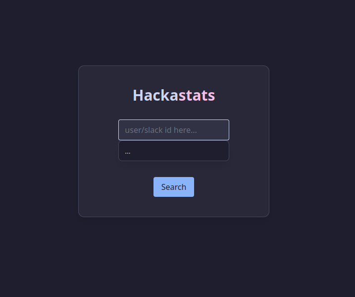
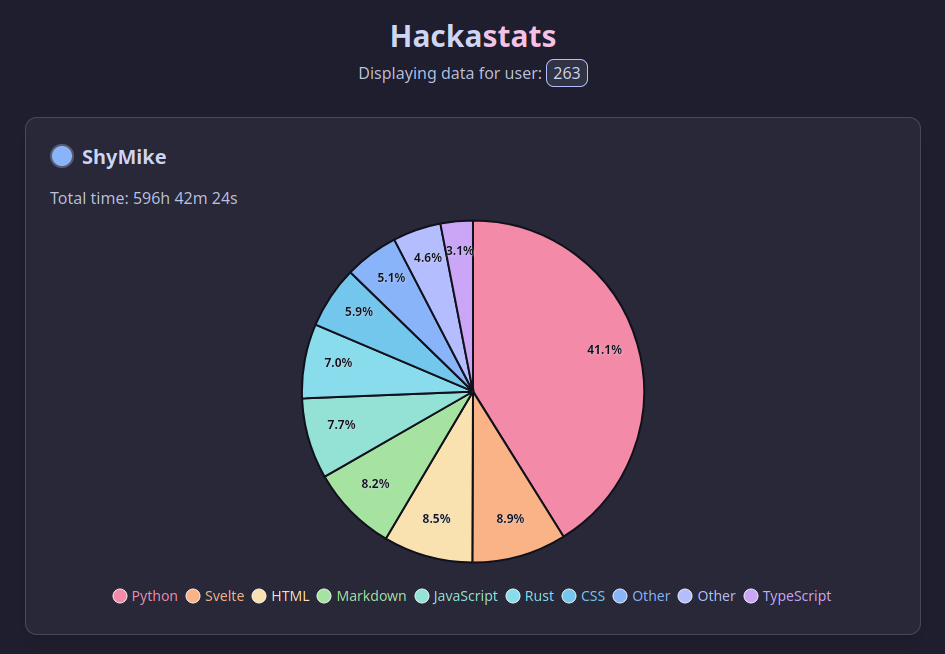
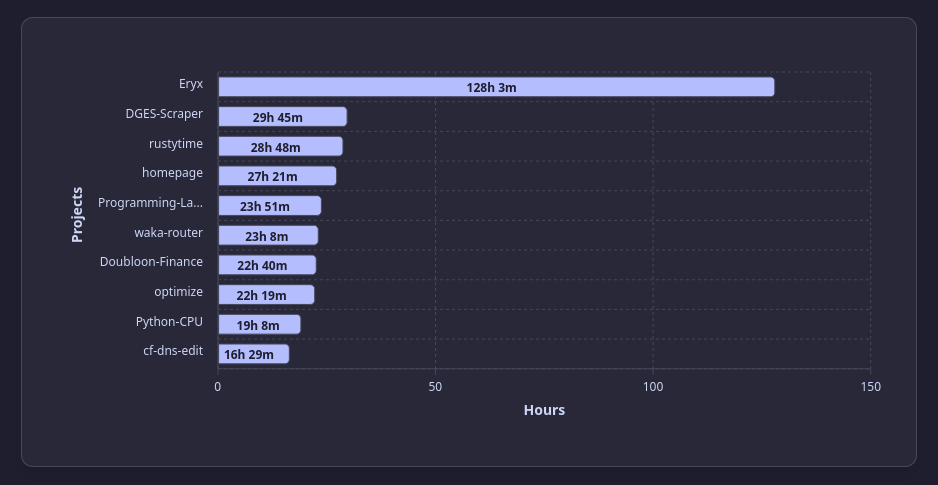
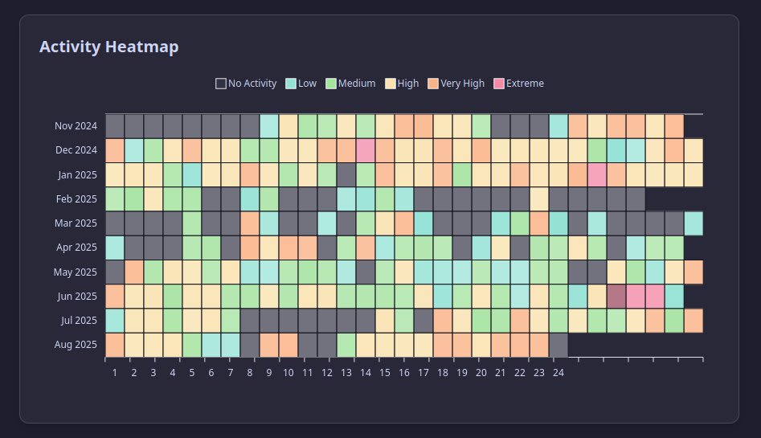
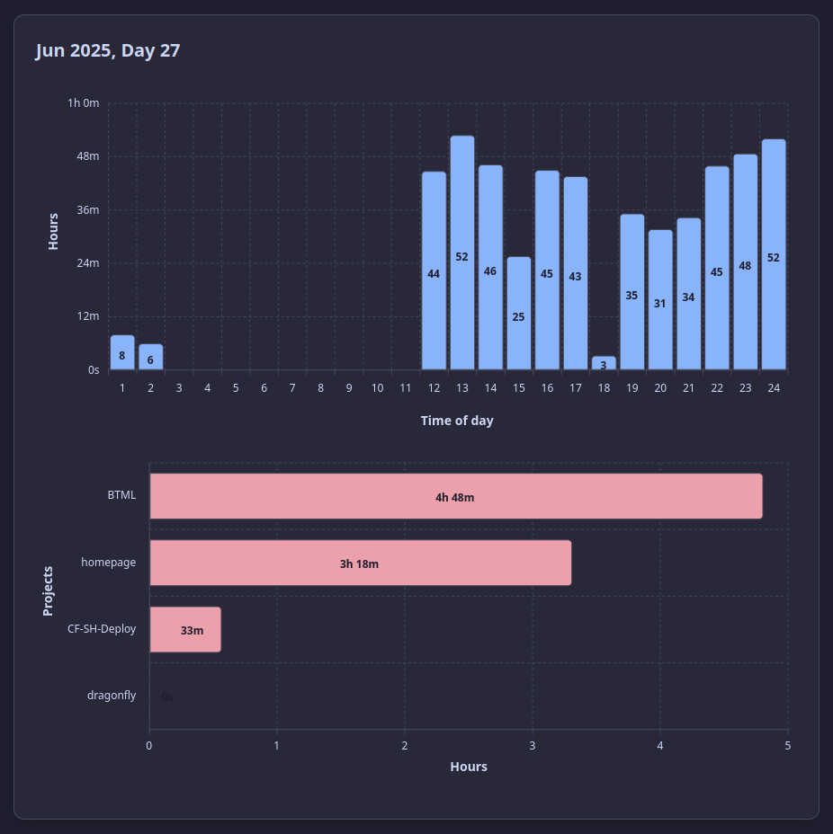

# hackastats

An easy to use Hackatime stats viewer.



---

It can be used to view anyone's public hackatime data using their Slack or Hackatime ID using multiple different graphs and visualizations!

## Images






## Developing

Run in development mode:

```sh
npm run dev
```

## Building

Build the app:

```sh
npm run build
```
